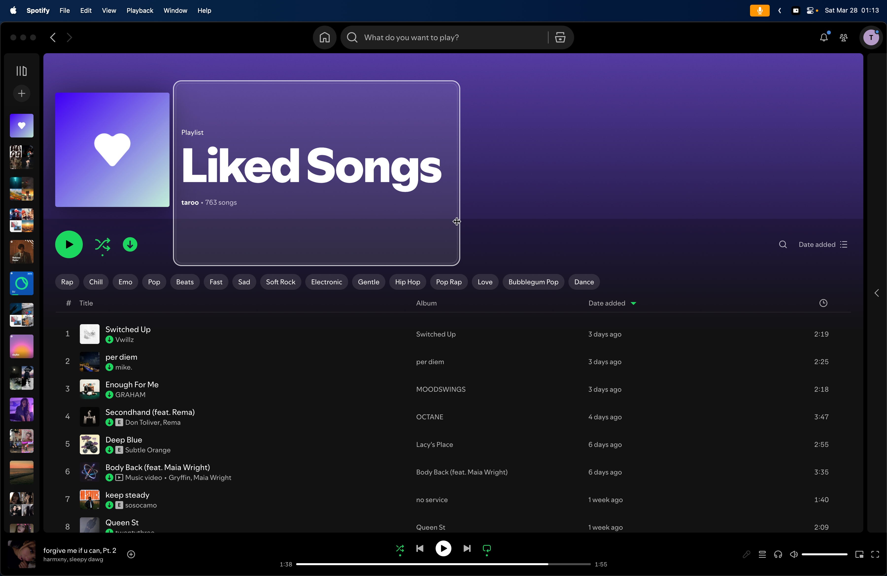

# Magnify

<p align="center">
  
</p>

Magnify is a lightweight macOS video conferencing tool that turns a draggable screen region into a clean full-screen live zoom view for demos, calls, and screen shares.

## Screenshots

**Edit mode**



**Presentation mode**


## Install

```bash
make install
open /Applications/Magnify.app
```

Grant Screen Recording permission when macOS prompts for it.

## Release

```bash
make release-archives
```

That writes `dist/Magnify.app`, `dist/Magnify.zip`, and `dist/Magnify.dmg`. For public distribution without Gatekeeper warnings, set `SIGNING_IDENTITY` and optionally `NOTARY_PROFILE` before running the release target.

## Use

- `Cmd+Opt+E`: show or hide the edit pane
- Drag and resize the pane to choose the region you want to present
- `Cmd+Opt+M`: toggle presentation mode
- `Opt+8`: toggle cursor zoom mode
- `Opt+=`: zoom in the cursor zoom mode
- `Opt+-`: zoom out the cursor zoom mode
